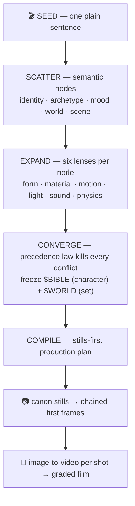

# FTPA — the Funnel-Tree Prompt Architecture

**A prompting style, a compilable language, and a one-command studio for cinematic AI video.**

One sentence in. A directed, graded, multi-shot film out — with the **same character, the same set, and real film logic** in every shot.

```bash
node ftl-studio.mjs "an old lighthouse keeper repairing the great lamp as a storm closes in" --shots 4
```

<p align="center">
  
  
  
</p>
<p align="center"><i>Generated by this repo, from the one sentence above: the locked character, the locked set, and a directed film frame built from both.</i></p>

---

## Why plain prompting fails — and what this does differently

Everyone who has prompted a video model knows the pattern: the first clip is
magic, the second clip stars a *different actor* in a *different room*, and by
clip three your "film" is a slideshow of strangers. We hit every one of those
walls building this — copyright filters, character drift, policy rejections,
posed lifeless tableaus — and compiled every lesson into an architecture.

**The core idea: prompts should be *compiled*, not written.**



## The architecture, layer by layer

| Layer | What it locks | The rule that earns it |
|---|---|---|
| **The Funnel** | story logic | scatter a sentence into typed nodes, expand each through six lenses, converge with a precedence law (identity > archetype > mood > world) — contradictions die before the model ever sees them |
| **FTL-1Q · Quality Laws** | photography | one small precise action per shot, motivated light only, shallow depth of field, slow cameras, one macro insert per film — reverse-engineered from what video models render *best* |
| **FTL-1S · Sync Protocol** | identity | text alone cannot lock a face: canon stills are approved once, then every frame is *composited from them* and chained to the previous frame |
| **FTL-1W · Causality Laws** | physical truth | characters mark the world (bootprints, rag arcs, worn rails) and the world reacts (dust stirs, flames answer drafts) — consequence is what reads as real |
| **Director's Rules** | film grammar | candid frames (never look at camera), rule-of-thirds, shot-size arcs (wide → medium → macro → payoff), one prop through-line, locked screen direction |
| **The Finishing Pass** | one look | unified grade, fine grain, cross-dissolves with audio crossfades, loudness-normalized mix — one film, not four clips |

## What's in this repo

| File | What it is |
|---|---|
| **`ftl-studio.mjs`** | the studio: CLI **and** importable library, zero dependencies (Node 18+, ffmpeg optional). Claude compiles the plan → Gemini generates canon stills and chained frames → Veo animates → ffmpeg finishes |
| **`ARCHITECTURE.md`** | the full written spec of FTPA and the FTL language |
| **`INTEGRATION.md`** | embed the pipeline in your own product via `makeFilm()` |
| **`funnel-tree.html`** | interactive walkthrough — watch a sentence scatter, expand, converge, and compile, stage by stage |
| **`compiler.html`** | browser compiler — any sentence → a full FTL program (bring your own API key, or manual mode with any chatbot) |
| **`flow-format.html`** | Google Flow / Veo's official prompt format, researched and worked through |
| **`films/lighthouse/`** | a complete sample project: the compiled plan, canon stills, and directed frames for *"The Keeper and the Ninth Prism"* |

## Quickstart

```bash
node ftl-studio.mjs setup            # writes keys.json — add your two keys
node ftl-studio.mjs models           # see which Google models your key can use
node ftl-studio.mjs "your film idea in one sentence" --shots 4 --skip-video
#                                    ^ cheap pass: plan + all stills, approve the look
node ftl-studio.mjs "your film idea in one sentence" --shots 4
#                                    ^ full pass: Veo clips + finished film.mp4
```

Keys: `ANTHROPIC_API_KEY` ([console.anthropic.com](https://console.anthropic.com)) and
`GOOGLE_API_KEY` ([aistudio.google.com/apikey](https://aistudio.google.com/apikey), paid tier for Veo).
Keys stay in your local `keys.json` — gitignored, never in this repo.

**The re-roll workflow is file deletion.** Don't like the character? Delete
`character.png` and re-run. A clip drifted? Delete `shot2.mp4` and re-run.
Everything else is kept. `plan.json` is the reproducible recipe for the whole film.

## The advantages, honestly stated

1. **Character & set persistence** — the thing everyone struggles with. Canon stills + frame chaining beat any amount of prompt wording.
2. **Film logic, not clip logic** — shot-size arcs, prop through-lines, screen direction, and causality are *compiled in*, so output cuts together like cinema.
3. **Policy-safe by construction** — plain film-brief language, positive phrasing, no trigger metaphors. Born from real rejections.
4. **Cost-gated** — approve cheap stills before a cent of video spend; partial failures (quota, filters) never lose finished work.
5. **Reproducible & portable** — the compiled plan is a JSON recipe; the language is model-agnostic (Veo today; the format layer adapts to Sora/Kling/Runway).

## What we want

We think **compiled, stills-first prompting** is how cinematic AI video should
be made, and we're putting the whole architecture in the open to push it:

- **Use it** — make films from single sentences; share your `plan.json` recipes.
- **Extend it** — adapters for Sora, Kling, Runway; new compiler verticals (ads, product demos, music video) are one system-prompt away (`INTEGRATION.md`).
- **Challenge it** — the laws in `ARCHITECTURE.md` were learned from failures; break them, prove better ones, PR them.

**Start here:** [CONTRIBUTING.md](CONTRIBUTING.md) · open a [Discussion](../../discussions) · grab a [help-wanted issue](../../issues?q=is%3Aissue+is%3Aopen+label%3A%22help+wanted%22)

MIT licensed. Built through a long day of real failures — copyright walls,
drifting faces, policy filters, pillarboxed frames — every one of which is now
a rule the compiler enforces so you don't have to learn it again.
