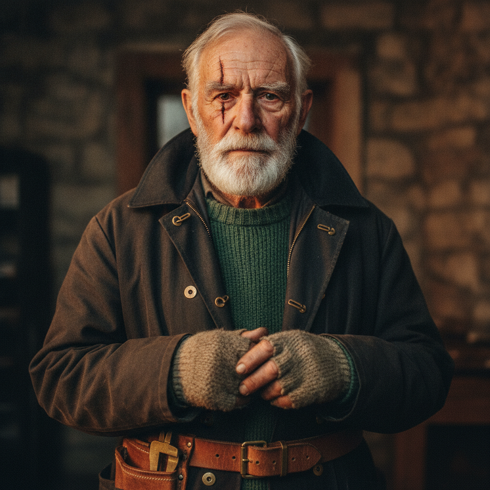
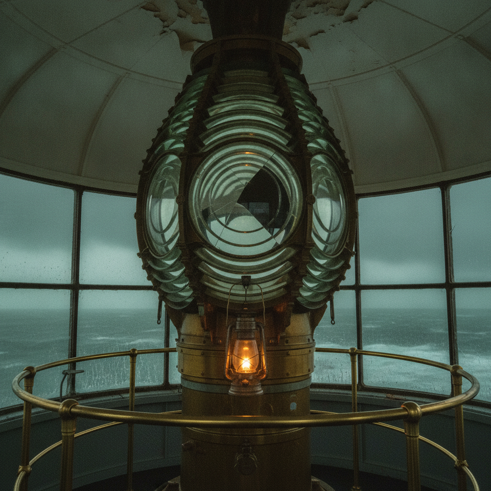
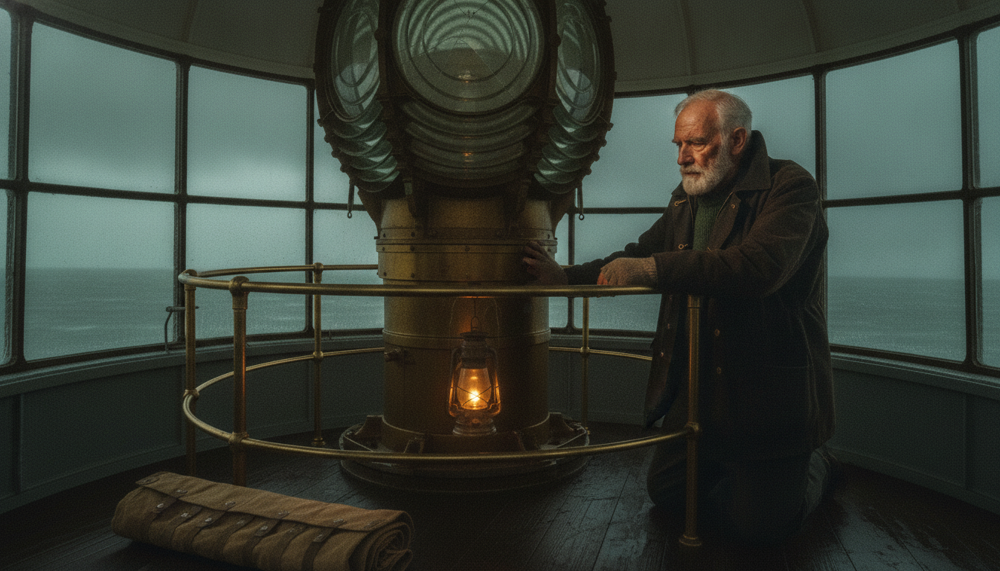
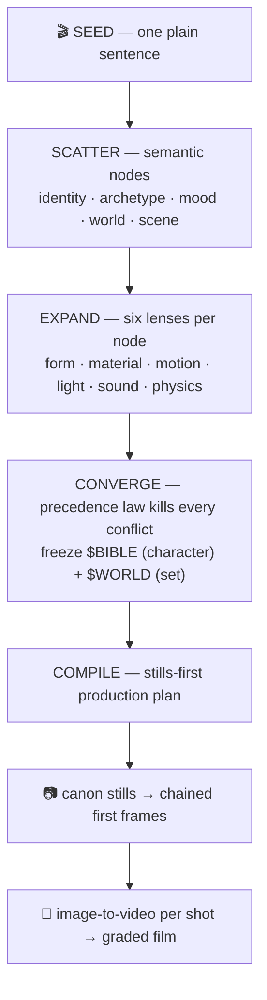

# AI Video Generator with Consistent Characters — FTL Studio (FTPA)

**Open-source AI video generation: turn one sentence into a directed, multi-shot cinematic film — with the same character and the same set in every shot.** Built on Google Veo 3.1, Gemini image generation, and Claude, with a prompt architecture (FTPA / the Funnel-Tree Prompt Language) that solves character drift in AI video.

[](https://github.com/uby174/ftl-studio)
[](https://github.com/uby174/ftl-studio)
[](LICENSE)

One sentence in. A directed, graded, multi-shot film out — with the **same character, the same set, and real film logic** in every shot.

```bash
node ftl-studio.mjs "an old lighthouse keeper repairing the great lamp as a storm closes in" --shots 4
```

<p align="center">
  
  
  
</p>
<p align="center"><i>Generated by this repo, from the one sentence above: the locked character, the locked set, and a directed film frame built from both.</i></p>

---

## Why plain prompting fails — and what this does differently

Everyone who has prompted a video model knows the pattern: the first clip is
magic, the second clip stars a *different actor* in a *different room*, and by
clip three your "film" is a slideshow of strangers. We hit every one of those
walls building this — copyright filters, character drift, policy rejections,
posed lifeless tableaus — and compiled every lesson into an architecture.

**The core idea: prompts should be *compiled*, not written.**



## The architecture, layer by layer

| Layer | What it locks | The rule that earns it |
|---|---|---|
| **The Funnel** | story logic | scatter a sentence into typed nodes, expand each through six lenses, converge with a precedence law (identity > archetype > mood > world) — contradictions die before the model ever sees them |
| **FTL-1Q · Quality Laws** | photography | one small precise action per shot, motivated light only, shallow depth of field, slow cameras, one macro insert per film — reverse-engineered from what video models render *best* |
| **FTL-1S · Sync Protocol** | identity | text alone cannot lock a face: canon stills are approved once, then every frame is *composited from them* and chained to the previous frame |
| **FTL-1W · Causality Laws** | physical truth | characters mark the world (bootprints, rag arcs, worn rails) and the world reacts (dust stirs, flames answer drafts) — consequence is what reads as real |
| **Director's Rules** | film grammar | candid frames (never look at camera), rule-of-thirds, shot-size arcs (wide → medium → macro → payoff), one prop through-line, locked screen direction |
| **The Finishing Pass** | one look | unified grade, fine grain, cross-dissolves with audio crossfades, loudness-normalized mix — one film, not four clips |

## What's in this repo

| File | What it is |
|---|---|
| **`ftl-studio.mjs`** | the studio: CLI **and** importable library, zero dependencies (Node 18+, ffmpeg optional). Claude compiles the plan → Gemini generates canon stills and chained frames → Veo animates → ffmpeg finishes |
| **`ARCHITECTURE.md`** | the full written spec of FTPA and the FTL language |
| **`INTEGRATION.md`** | embed the pipeline in your own product via `makeFilm()` |
| **`funnel-tree.html`** | interactive walkthrough — watch a sentence scatter, expand, converge, and compile, stage by stage |
| **`compiler.html`** | browser compiler — any sentence → a full FTL program (bring your own API key, or manual mode with any chatbot) |
| **`flow-format.html`** | Google Flow / Veo's official prompt format, researched and worked through |
| **`films/lighthouse/`** | a complete sample project: the compiled plan, canon stills, and directed frames for *"The Keeper and the Ninth Prism"* |

## Quickstart

```bash
node ftl-studio.mjs setup            # writes keys.json — add your two keys
node ftl-studio.mjs models           # see which Google models your key can use
node ftl-studio.mjs "your film idea in one sentence" --shots 4 --skip-video
#                                    ^ cheap pass: plan + all stills, approve the look
node ftl-studio.mjs "your film idea in one sentence" --shots 4
#                                    ^ full pass: Veo clips + finished film.mp4
```

Keys: `ANTHROPIC_API_KEY` ([console.anthropic.com](https://console.anthropic.com)) and
`GOOGLE_API_KEY` ([aistudio.google.com/apikey](https://aistudio.google.com/apikey), paid tier for Veo).
Keys stay in your local `keys.json` — gitignored, never in this repo.

**The re-roll workflow is file deletion.** Don't like the character? Delete
`character.png` and re-run. A clip drifted? Delete `shot2.mp4` and re-run.
Everything else is kept. `plan.json` is the reproducible recipe for the whole film.

## The advantages, honestly stated

1. **Character & set persistence** — the thing everyone struggles with. Canon stills + frame chaining beat any amount of prompt wording.
2. **Film logic, not clip logic** — shot-size arcs, prop through-lines, screen direction, and causality are *compiled in*, so output cuts together like cinema.
3. **Policy-safe by construction** — plain film-brief language, positive phrasing, no trigger metaphors. Born from real rejections.
4. **Cost-gated** — approve cheap stills before a cent of video spend; partial failures (quota, filters) never lose finished work.
5. **Auditable & portable** — every frame and every rendered clip is scored 0-100 by a **cross-family** vision judge (Claude judging Google-generated images, so the critic doesn't share the generator's blind spots), and the verdicts are written to `qc.json`. The compiled `plan.json` is a reproducible *recipe*; the pixels are not bit-reproducible — the image and video APIs expose no seed. The language is model-agnostic (Veo and Gemini Omni today; the adapter contract is one function).

## Does it actually work? — `EVAL.md`

Claims in this repo are measured, not asserted:

```bash
node eval.mjs                    # 3 seeds × {full, no-canon baseline}
node eval.mjs --conditions all   # + no-judge, no-chain, no-manifest ablations
```

Each condition runs identical seeds with one mechanism disabled and scores every
frame against that run's own canon on four axes — identity, wardrobe, set match,
manifest compliance. A frame scores its **weakest** axis, because an averaged
score hides a failed face. `no-canon` is the naive baseline: no reference images,
every shot generated from text alone. Results land in `EVAL.md` with per-mechanism
deltas; any law that shows no delta is a candidate for deletion from the compiler.

## What we want

We think **compiled, stills-first prompting** is how cinematic AI video should
be made, and we're putting the whole architecture in the open to push it:

- **Use it** — make films from single sentences; share your `plan.json` recipes.
- **Extend it** — adapters for Sora, Kling, Runway; new compiler verticals (ads, product demos, music video) are one system-prompt away (`INTEGRATION.md`).
- **Challenge it** — the laws in `ARCHITECTURE.md` were learned from failures; break them, prove better ones, PR them.

**Start here:** [CONTRIBUTING.md](CONTRIBUTING.md) · open a [Discussion](../../discussions) · grab a [help-wanted issue](../../issues?q=is%3Aissue+is%3Aopen+label%3A%22help+wanted%22)

## FAQ

### How do I keep the same character across multiple AI video clips?
Text prompts alone cannot lock a face — every generation re-imagines it. FTL Studio solves this by generating a **canon character still once**, then compositing every shot's first frame from that image and animating only approved frames (image-to-video). A vision judge audits each frame against the canon before any video is generated. See [ARCHITECTURE.md](ARCHITECTURE.md) → FTL-1S Sync Protocol.

### Can I generate a multi-shot AI film from a single prompt?
Yes. `node ftl-studio.mjs "your idea" --shots 4` compiles your sentence into a production plan (character, set, per-shot framing, motion prompts, audio), generates the stills, animates each shot, and assembles a graded film with hard cuts.

### Which video models does this support?
Google **Veo 3.1** and **Gemini Omni Flash** ship today via the Gemini API, selected by one config line. Adapters for **Sora**, **Kling**, **Runway**, and **Luma** are open issues — the contract is a single function, `genVideo(cfg, motionPrompt, firstFramePng, seconds, outPath)`.

### What is the best prompt format for Veo 3?
Google's official formula is `[Cinematography] + [Subject] + [Action] + [Context] + [Style & Ambiance]`, with audio as separate sentences (`SFX:`, `Ambient noise:`) and dialogue in quotes. FTL Studio emits exactly this format automatically — see [`flow-format.html`](flow-format.html) for the researched breakdown and worked examples.

### Why do my AI videos look like "AI slop"?
Common causes this project fixes by construction: posed portraits instead of candid film frames, unmotivated lighting, big motion instead of one small precise action, no shot grammar (wide → medium → insert → payoff), no causality (nothing marks the world), and cross-dissolves instead of hard cuts on action. Each is encoded as a compiler law in [ARCHITECTURE.md](ARCHITECTURE.md).

### Is it free?
The code is MIT licensed and free. Model usage is billed by Google (Gemini image + Veo/Omni video) and Anthropic (compiler). Run with `--skip-video` to compile plans and stills for cents before spending on video.

### Can I use this in my own app?
Yes — `ftl-studio.mjs` is importable and side-effect-free: `import { makeFilm } from './ftl-studio.mjs'`. See [INTEGRATION.md](INTEGRATION.md).

---

<sub>**Keywords:** AI video generator, text to video AI, image to video, Veo 3 prompt guide, Veo 3.1 API, Gemini video generation, consistent character AI video, AI film maker, AI short film generator, cinematic AI video, prompt engineering for video, Google Flow prompts, AI storyboard generator, multi-shot AI video, open source AI video tool.</sub>

MIT licensed. Built through a long day of real failures — copyright walls,
drifting faces, policy filters, pillarboxed frames — every one of which is now
a rule the compiler enforces so you don't have to learn it again.
